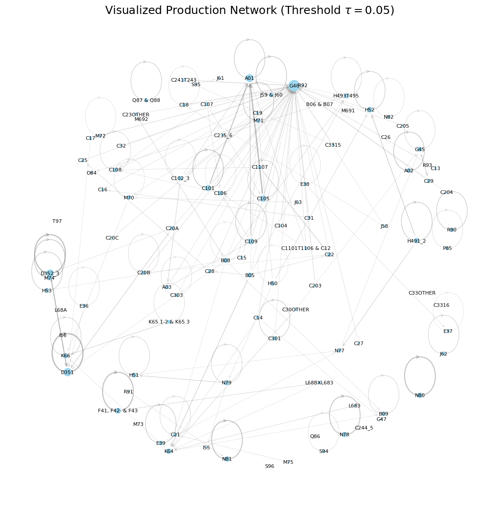
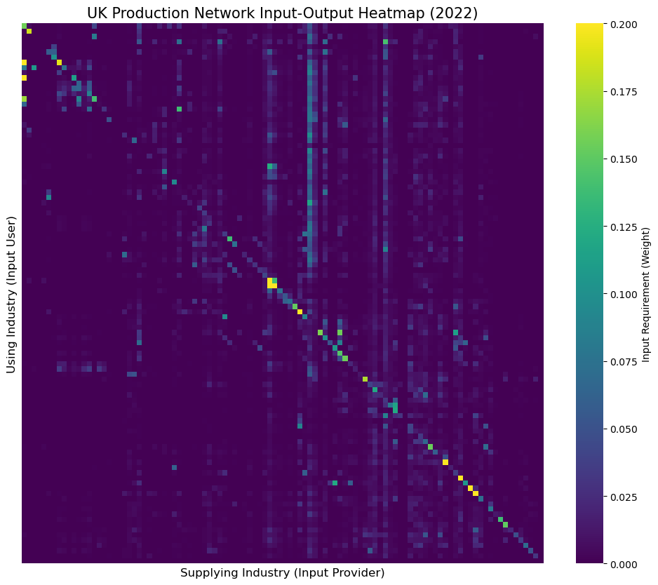
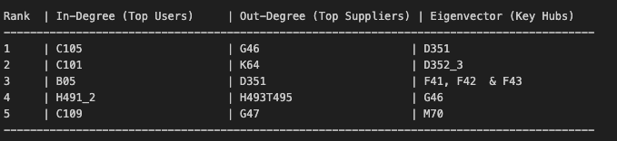
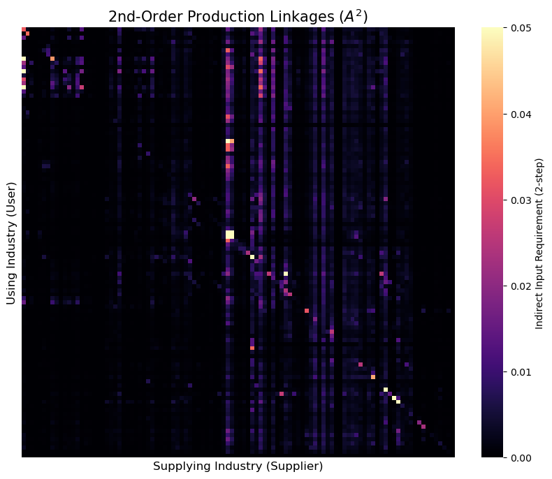
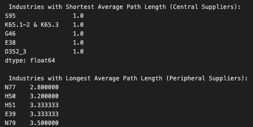
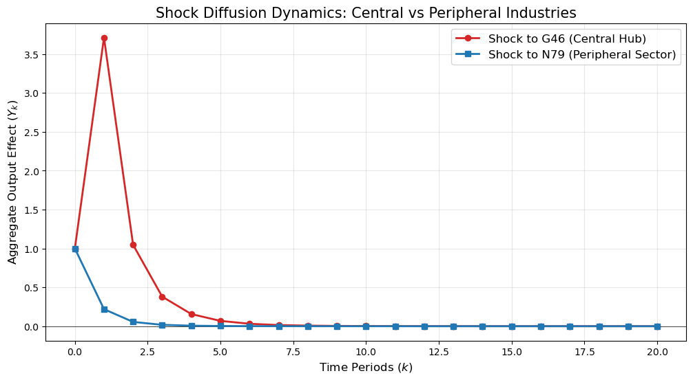
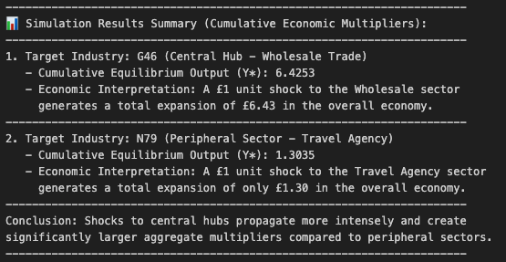

# UK Production Network Analysis and Shock Diffusion



Network analysis project using the UK 2022 Input-Output table to model industrial production networks, identify systemic hubs, and simulate shock diffusion dynamics across the economy.

**Keywords:** network analysis, input-output network, systemic risk, shock propagation, graph theory, production network, centrality analysis

---

## 1. Project Overview

This project models the UK production system as a weighted directed network using the 2022 UK Input-Output table.

The analysis investigates:

- Industrial interdependence and production topology
- Central hub industries within the supply chain
- Network-based measures of systemic importance
- Shock propagation and economic diffusion dynamics

Using graph-theoretic methods and matrix-based network analysis, the project examines how network structure influences the transmission and amplification of economic shocks.

---

## 2. Network Construction

The UK Input-Output matrix was interpreted as a weighted adjacency matrix:

$$
y = Ay + \epsilon
$$

where:

- Rows represent using industries
- Columns represent supplying industries
- Edge weights represent input dependence intensity

The resulting network captures how industries rely on one another within the UK production system.

---

### Input-Output Heatmap

The production network was first visualized as a heatmap in order to examine overall network structure.



Several important structural patterns emerge:

- The network is highly sparse, with most industry pairs weakly connected
- Strong diagonal elements indicate significant intra-industry dependence
- Prominent vertical strips reveal "universal supplier" industries such as wholesale trade and electricity

These patterns suggest that a small number of industries provide critical inputs across large parts of the economy.

---

### Network Graph and Sparsification

To reveal the backbone structure of the production network, a sparsification threshold of:

$$
\tau = 0.05
$$

was applied to remove weak connections.


The resulting graph highlights a clear core-periphery structure:

- Central hub industries occupy densely connected positions
- Peripheral sectors remain weakly connected to the broader economy
- Wholesale trade and energy-related sectors emerge as major supply-chain hubs

The visualization suggests that the UK economy is organized around a relatively small number of highly connected industries rather than a fully decentralized production structure.

---

## 3. Centrality Analysis

To evaluate the systemic importance of industries within the production network, several centrality measures were computed:

- Weighted in-degree
- Weighted out-degree
- Eigenvector centrality

These measures capture different dimensions of economic importance.

---

### Degree-Based Centrality

Weighted in-degree measures total input consumption, identifying industries that depend heavily on upstream suppliers.

Weighted out-degree measures total supply provision, identifying industries that distribute inputs broadly across the economy.

The analysis identified:

- Manufacturing industries as major input consumers
- Wholesale trade and financial services as dominant suppliers

---

### Eigenvector Centrality

Unlike degree measures, eigenvector centrality evaluates not only the number of connections but also the importance of connected neighbors.



The results show that electricity-related sectors possess exceptionally high structural importance despite not always having the largest transaction volume.

This distinction highlights an important network insight:

> Transaction volume and systemic importance are not necessarily identical.

Industries connected to other influential sectors can become critical hubs for macroeconomic stability and shock transmission.


## 4. Higher-Order Linkages

While the original input-output matrix captures direct production dependencies, higher-order matrix powers reveal indirect supply-chain relationships.

In particular:

$$
A^2
$$

captures second-order production linkages, identifying industries connected indirectly through intermediate suppliers.



Compared to the original network matrix, the second-order linkage structure becomes substantially denser, indicating that many industries are indirectly connected even when no direct transaction exists.

Several industries emerge as "invisible backbone" sectors within the economy:

- Wholesale trade
- Financial services
- Energy-related industries

These sectors influence production chains indirectly across large portions of the network, reinforcing their systemic importance.

---

## 5. Shock Diffusion Simulation

The project additionally simulated how productivity shocks propagate through the production network over time.

Shock transmission dynamics were modeled using:

$$
\hat{y}^{(k)} = A^k \epsilon
$$

where higher powers of the network matrix represent multi-step propagation effects across industries.

---

### Shortest Path Analysis

Shortest path analysis was used to distinguish:

- Central hub industries
- Peripheral industries

based on average network distance.

Industries with short average path lengths are directly connected to large parts of the economy, allowing shocks to spread rapidly.

Peripheral industries require multiple intermediate transmission steps, causing shocks to dissipate more gradually.



---

### Dynamic Shock Propagation

To compare network amplification effects, shocks were simulated for:

- G46 (Wholesale Trade) — central hub industry
- N79 (Travel Agency) — peripheral sector



The results reveal a strong contrast in propagation intensity:

- Shocks originating from central hubs spread rapidly and generate large aggregate effects
- Peripheral-sector shocks decay quickly with limited spillover effects

This demonstrates that network topology strongly influences both the speed and magnitude of macroeconomic shock transmission.

---

### Equilibrium Multipliers

Long-run equilibrium effects were computed to measure cumulative economic amplification.



The simulation results show:

- Central hub shocks generate significantly larger economic multipliers
- Peripheral sectors produce relatively weak aggregate spillovers

For example:

- A unit shock to wholesale trade generated a cumulative multiplier of approximately 6.43
- A comparable shock to the travel agency sector generated only 1.30

This highlights the importance of network position in determining systemic macroeconomic impact.

---

## 6. Key Findings

- Central industries amplify macroeconomic shocks far more strongly than peripheral sectors.

- Network topology determines both the speed and intensity of shock propagation.

- Wholesale trade, electricity, and financial services act as systemic production hubs within the UK economy.

- Higher-order production linkages reveal extensive indirect industrial dependence beyond direct trade relationships.

- Eigenvector centrality captures structural importance more effectively than transaction volume alone.

- Peripheral industries generate relatively weak aggregate spillover effects due to limited network connectivity.

---

## 7. Repository Structure

```plaintext
uk-production-network-analysis/
│
├── notebooks/
│   └── production_network_analysis.ipynb
│
├── figures/
│   ├── 001.png
│   ├── 002.png
│   ├── 003.png
│   ├── 004.png
│   ├── 005.png
│   ├── 006.png
│   └── 007.png
│
├── data/
│   └── UK_IO_Table.csv
│
├── requirements.txt
└── README.md
```

---

## 8. Tools and Libraries

The project was implemented using:

- Python
- NumPy
- pandas
- NetworkX
- matplotlib
- seaborn
- SciPy
- Jupyter Notebook

---

## 9. Korean Summary (한국어 요약)

이 프로젝트는 UK 산업연관표(Input-Output Table)를 활용하여  
산업 간 생산 네트워크를 graph 형태로 모델링하고 shock diffusion dynamics를 분석한 프로젝트입니다.

네트워크 중심성이 높은 산업일수록 경제 전체에 더 강한 파급효과를 발생시킨다는 점을 확인했으며,  
Wholesale, Electricity, Finance 산업이 핵심 systemic hub 역할을 수행함을 보여주었습니다.

또한 higher-order linkage와 shortest path 분석을 통해  
간접 공급망 연결과 macroeconomic shock propagation 구조를 함께 분석했습니다.
